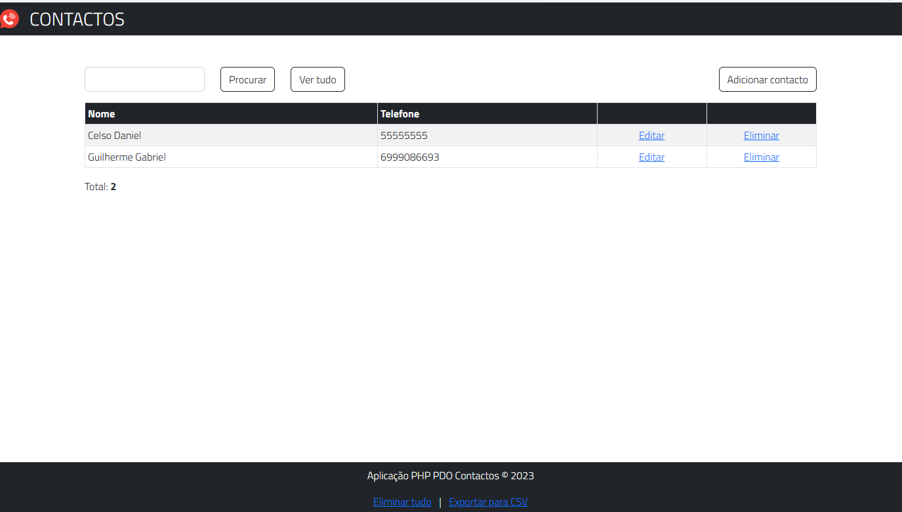

# Sobre o projeto

O regra de negócios é uma aplicação Back-end web construída por min com conhecimentos adiquiridos ao longo desses últimos meses estudando programação.

A aplicação consiste em uma simples listagem de contatos com conexão com MySQL por meio do PDO no PHP.

  
  
  

# Tecnologias utilizadas

# Autor

João Félix Santana de Sousa

https://www.linkedin.com/in/joaofelixss
